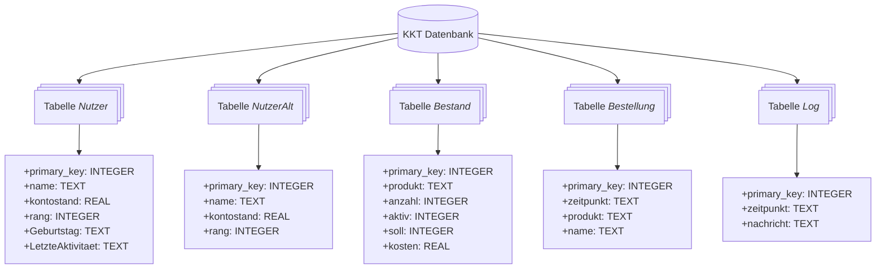

<div align="center"> 
   
# KKT

### ☕️ Software für die digitale Kaffeeküche - komplett in Python geschrieben ☕️

[English](https://github.com/AnselmSoftware/KKT/blob/main/README.md) | [Deutsch](https://github.com/AnselmSoftware/KKT/blob/main/README.md)

</div>

---
> [!NOTE]
> A detailed readme in English will follow soon ..\
---


## Übersicht
KKT (Kaffeekassentool) ist eine Software mit grafischer Benutzeroberfläche, die es vielen Nutzern einer Kaffeeküche ermöglicht, selbstständig Produkte wie beispielsweise Kaffee abzurechnen. Dies erleichtert die Verwaltung der Kaffeeküche bzw. Kaffeekasse und gibt jedem Nutzer einen Überblick über seine Ausgaben und Einzahlungen.

Wesentliche Merkmale:
- **Digital** – Keine nervigen analogen Kaffeelisten mehr, aus denen die Ausgaben der Nutzer händisch ermittelt werden müssen.
- **Benutzerfreundlich**  – Schlanke Übersicht aller Nutzer durch schlichte Buttons und selbsterklärender Kaufprozess von Produkten.
- **Sicher** – Verwendung einer SQL-Datenbank für alle Daten des KKT bzw. der Nutzer. Ermöglicht das Sichern und Auslesen der Daten auch ohne die Software.
- **Einfach zu verwalten** – Vom Anlegen neuer Nutzer über das Aufladen von Guthaben auf ein Nutzerkonto bis hin zum Ein- und Austragen vorhandener Produkte ist alles innerhalb der Software möglich - ohne manuelle Interaktion mit der Datenbank.
- **Online** – Verantwortliche profitieren vom automatischen Erhalt von Statusmails über den Bestand von Produkten und Ereignissen im KKT.

<div align="center">

</div>

## Funktionen des KKT
Die Software startet mit einer Übersichtsseite, auf der alle (aktiven) Nutzer angezeigt werden. Diese kann als Hauptfenster betrachtet werden. Am unteren Rand dieser Seite befindet sich eine Leiste mit einem grünen Knopf (siehe Abbildung). Im Falle eines internen Fehlers springt dieser Knopf auf Rot. Über diesen Knopf kann ein Fenster geöffnet werden, das Informationen zur Software und deren Entwicklung bereitstellt. In dieser Leiste wird außerdem ein anstehender Geburtstag eines Nutzers angezeigt. Rechts davon befindet sich ein Button zum Anlegen eines neuen Nutzers.

<div align="center">

</div>

Auf der Übersichtsseite werden die Nutzer in drei Gruppen eingeteilt. Diese Gruppen sind in der Software voreingestellt und heißen _Permanente_, _wissenschaftliche Mitarbeiter_ und _Studierende_. Andere Gruppennamen können auf Wunsch vergeben werden, indem `KKT_Parameter.py` angepasst wird.\
Neue Nutzer werden in einem separaten Fenster angelegt (siehe Abbildung). In diesem muss der Name des neuen Nutzers angegeben werden. Dieser muss sinnvoll gewählt werden und wird vor der Anlage des Nutzers überprüft. Des Weiteren wird der Name nach dem Anlegen des neuen Nutzers formatiert. Falls vorhanden, wird der Vorname mit einem Punkt abgekürzt und folgt dem Nachnamen. Zudem muss eine Zuordnung zu einer Gruppe erfolgen. Nutzer der letzten Gruppe _Studierende_ müssen einen Betreuer angeben, sodass im Falle eines Ausscheidens des Nutzers eine Person für eventuell verbliebene Schulden geradestehen kann. Der Geburtstag kann angegeben werden, wenn dieser auf der Übersichtsseite erscheinen soll (freiwillig).

<div align="center">
   
</div>

Auf der Übersichtsseite können Nutzer durch einen langen Klick gelöscht werden. Hierzu mindestens drei Sekunden lang den Button des jeweiligen Nutzers gedrückt halten (Zeitspanne kann in `KKT_Parameter.py` verändert werden). Falls mit dem Nutzer eine Abrechnung des Guthabens / der Schulden stattgefunden hat, kann dies beim Löschen angegeben werden. Gelöschte Nutzer werden automatisch in der Datenbank archiviert und können so später reaktiviert werden.\
KKT ermittelt im Hintergrund, ob ein Nutzer über einen längeren Zeitraum inaktiv war (Zeitspanne kann in `KKT_Parameter.py` verändert werden). Eine längere Inaktivität wird daraufhin durch ein blaues Datum unter dem Namen angezeigt, dass die letzte Aktivität angibt. Diese Information kann genutzt werden, um inaktive Nutzer zu löschen.\
Durch einen einfachen Klick auf einen Nutzer wird die Bestellübersicht geöffnet (siehe Abbildung). Oben links wird der Name des Nutzers angezeigt und es wird die Möglichkeit geboten, einen Doktortitel zu erwerben (Spaß-Feature). Zudem wird der aktuelle Kontostand angezeigt. Über zwei Buttons besteht die Möglichkeit, die letzten Käufe in einem Kontoauszug anzuzeigen und das Konto aufzuladen.

<div align="center">
   
</div>

Im Fenster der Bestellübersicht können die Produkte für den Kauf ausgewählt werden. Solange der Kauf noch nicht bestätigt wurde, lässt sich die Auswahl korrigieren. Produkte, deren Bestand auf _Null_ gefallen ist, werden rot markiert und können nicht mehr ausgewählt werden. Nach dem Kauf werden der Bestand der Produkte und der Kontostand des Nutzers automatisch angepasst.
Es gibt ein Schuldenlimit für Nutzer, ab dem keine Käufe mehr getätigt werden können (in `KKT_Parameter.py` festgelegt). Ab einem Drittel des Schuldenlimits wird der Kontostand in der Bestellübersicht rot markiert. Ab zwei Dritteln des Schuldenlimits werden Zinsen auf den Kauf von Produkten erhoben. Diese steigen mit der Höhe der Schulden exponentiell an (Minimalzins: ca. 0,05 %, Maximalzins: ca. 2,5 %) bis das Schuldenlimit erreicht ist. Dieses Feature soll Nutzer dazu bringen, ihr Konto rechtzeitig aufzuladen.\
Werden Produkte, wie beispielsweise Kaffee, neu gekauft, muss der Bestand in der Software entsprechend erhöht werden. Hierzu den Button des jeweiligen Produkts mindestens zwei Sekunden lang gedrückt halten (Zeitspanne kann in `KKT_Parameter.py` verändert werden). In einem separaten Fenster (siehe Abbildung) kann der Bestand um einen auswählbaren Betrag erhöht oder um den aktuellen Bestand reduziert werden (zur Korrektur von Fehleingaben). Zudem können nicht abgerechnete Produkte auf ein _Diebstahlkonto_ gebucht werden. Dies ermöglicht es, den Verlust der Kaffeeküche nach einer Weile genau zu protokollieren. Hierzu die Datenbank auswerten – der Kontostand des _Diebstahlkontos_ entspricht dem Verlust.

<div align="center">
   
</div>

Über das Fenster der Bestellübersicht können Nutzer durch Klicken auf den entsprechenden Button ihr Konto auch selbstständig aufladen. In einem separaten Fenster können unterschiedliche Beträge ausgewählt werden (siehe Abbildung). Darüber hinaus kann ein kleiner Betrag (in `KKT_Parameter.py` festgelegt) ausgewählt werden, der für das Ausräumen einer Spülmaschine vorgesehen ist. Damit sollen die Nutzer motiviert werden, dies auch zu tun. Erst nach Ablauf einer bestimmten Zeitspanne ist eine erneute Auswahl dieses Betrags möglich (in `KKT_Parameter.py` festgelegt). Auf der rechten Seite werden, falls vorhanden, die Bankdaten des Verantwortlichen der Kaffeeküche angezeigt. Die tatsächliche Transaktion basiert auf Vertrauensbasis, beispielsweise durch Überweisung oder Einwurf von Bargeld in eine Kaffeekasse / Sparbüchse in der Kaffeeküche.

<div align="center">
   
</div>

Ebenfalls über das Fenster der Bestellübersicht können Nutzer durch Klicken auf den entsprechenden Button einen Kontoauszug aufrufen. In dem separaten Fenster werden auf der linken Seite die letzten Käufe mit dem jeweiligen Datum angezeigt (siehe Abbildung). Es wird auch angegeben, wie viel Geld insgesamt im betrachteten Zeitraum ausgegeben wurde. Die Ausgaben pro Tag werden auf der rechten Seite zusätzlich in einer informativen Grafik dargestellt.

<div align="center">
   
</div>

KKT ermittelt im Hintergrund für jede Kalenderwoche den Umsatz und speichert diese Information in der Datenbank. So lässt sich nach einiger Zeit ebenfalls erkennen, ob die Einnahmen und Ausgaben übereinstimmen oder ob zu viele Produkte nicht abgerechnet wurden.

Ein besonderes Feature des KKT ist das automatische Versenden von Statusmails. In diesen E-Mails wird über den noch vorhandenen Bestand von Produkten informiert, sofern dieser einen festgelegten Grenzwert (in Datenbank festgelegt) unterschreitet. Zusätzlich werden die letzten Systemmeldungen bzw. Ereignisse des KKT angehängt. Es wird nur eine E-Mail pro Woche mit allen Informationen versendet. E-Mails, die Auskunft über den Bestand geben, können dagegen einmal pro Tag versendet werden.

## Installation (auf Raspberry Pi)
### Notwendige Pakete bzw. Python-Bibliotheken
Wenn KKT auf einem Raspberry Pi mit Touchscreen installiert werden soll, muss dieser zunächst vollständig mit einer Desktopumgebung eingerichtet werden. KKT benötigt verschiedene Pakete bzw. Python-Bibliotheken, die installiert sein müssen:
- **GTK 3.0** – In der Regel in Raspbian / Raspberry Pi OS enthalten.
- **Python3.x** – In der Regel in Raspbian / Raspberry Pi OS enthalten.
- **python3-gi-cairo** – Für die Darstellung der Diagramme im KKT.
```
sudo apt-get install python3-gi-cairo
```
- **python3-numpy** – Für die Erstellung der Diagramme.
```
sudo apt-get install python3-numpy
```
- **python3-matplotlib** – Ebenfalls für die Erstellung der Diagramme.
```
sudo apt-get install python3-matplotlib
```
- **unclutter** (optional) – Lässt den Mauszeiger verschwinden. Funktioniert allerdings mit dem neuen Raspberry Pi OS nicht mehr. Grund hierfür ist der Wechsel auf Wayland.
```
sudo apt-get install unclutter
```
- **xscreensaver** (optional) – Vermeidet einen [Sperrbildschirm](https://stackoverflow.com/questions/30985964/how-to-disable-sleeping-on-raspberry-pi), der bei Berührung im Hintergrund einen Klick ausführt. Funktioniert unter Umständen mit dem neuen Raspberry Pi OS nicht mehr.
```
sudo apt-get install xscreensaver
```

### Starten der Software
KKT kann entweder über die Konsole im Ordner der Software mit dem Befehl
```
sudo python3.x KKT_Main.py
```
gestartet werden, wobei `x` für die installierte Python-Version steht. Alternativ kann ein einfaches Bash-Skript auf dem Desktop platziert werden, das durch einen Klick die Software startet. Beispielhafter Code für das Bash-Skript:
```
!/bin/bash
cd Pfad
sudo python3.x ./KKT_Main.py
```
Dabei ist die Bezeichnung `Pfad` durch den Pfad zum selbst angelegten Ordner mit allen Daten des KKT zu ersetzen.
Wichtig: Das KKT muss innerhalb einer laufenden grafischen Benutzeroberfläche gestartet werden.

Sollte KKT zu diesem Zeitpunkt noch nicht starten, könnte das an weiteren fehlenden Paketen liegen. In diesem Fall müssen die noch fehlenden Pakete anhand der Fehlermeldungen identifiziert und installiert werden.

### Tipp: Server für Backups
Die Einrichtung eines Servers, der es ermöglicht, einen Ordner auf dem Gerät (Raspberry Pi) als Netzwerklaufwerk auf einem anderen Gerät zu nutzen, kann praktisch sein, wenn es um das Erstellen von (automatischen) Backups der Datenbank geht. Hierfür kann beispielsweise ein Samba-Server eingesetzt werden. Es wird empfohlen regelmäßige Backups von der SQL-Datenbank `KKT_database.sqlite` anzulegen.

## Aufbau des KKT
Die Software besteht aus den einzelnen Python-Dateien `KKT_Main.py`, `KKT_Parameter.py`, `KKT_Verwaltung.py`, `GUIElemente.py` und `DBVerwaltung.py`. Zudem sind die beiden Dateien `KKT_GUI.glade` und `GUITastatur.glade` enthalten aus denen die grafische Benutzeroberfläche aufgebaut wird. Des Weiteren existiert die Datenbank `KKT_database.sqlite` für alle Daten des KKT bzw. der Nutzer sowie einige Bilder `KKT_img_Warning.png`, `KKT_img_Purchased.png`, `KKT_img_Stop.png`, `KKT_img_Logo.png`, `KKT_img_QRCode.png`, die innerhalb der Software dargestellt werden. Für den Verantwortlichen der Kaffeeküche sind nur die folgenden Dateien von Interesse:
- `KKT_Main.py`
- `KKT_Parameter.py`
- `KKT_database.sqlite`
- `KKT_img_QRCode.png`

Zum Starten der Software muss `KKT_Main.py` aufgerufen werden (s. [Oben](#Starten-der-Software)). `KKT_Parameter.py`, `KKT_database.sqlite` und `KKT_img_QRCode.png` müssen einmalig an die Bedürfnisse der Kaffeeküche bzw. des Verantwortlichen angepasst werden (s. [Unten](#Anpassungen-vor-Start)).\
Der Code des KKT ist hauptsächlich in der Datei `KKT_Main.py` zu finden. Für Entwickler ist diese Datei die interessanteste (erste) Anlaufstelle. In der Datei `KKT_Parameter.py` sind alle relevanten Variablen ausgelagert. In den übrigen Python-Dateien sind einzelne Funktionen zu finden. Dazu gehören beispielsweise die Interaktion mit der Datenbank und die Bereitstellung einer Bildschirmtastatur. Die beiden Glade-Dateien `KKT_GUI.glade` und `GUITastatur.glade` wurden mit der Software _Glade 3.40.0_ erstellt und können mit dieser Software auch wieder verändert bzw. weiterentwickelt werden. In diesen Dateien befinden sich in XML die Informationen vieler GUI-Elemente wie Buttons oder Labels. Der Aufbau der Datenbank `KKT_database.sqlite` wird in einem separaten Kapitel erläutert (s. [Unten](#Aufbau-der-Datenbank)).

## Anpassungen vor Start
### Parameterdatei
Die Datei `KKT_Parameter.py` muss einmalig an die Bedürfnisse der jeweiligen Kaffeeküche bzw. des Verantwortlichen angepasst werden. Die Variablen in der Datei sind in drei Kategorien eingeteilt:  1. Variablen, die die nach außen gerichtete Funktionalität für Nutzer steuern, 2. Variablen, die eher die interne Funktionalität steuern, 3. Variablen, die nur für Entwickler von Interesse sind. Alle Variablen sind kommentiert, sodass die Zuordnung einfach möglich sein dürfte. Folgende Variablen sollten beachtet bzw. angepasst werden:
- Maximaler Schuldenstand eines Nutzers
- Gutschrift für das Ausräumen einer Spülmaschine (als Motivation gedacht)
- Nach welcher Zeitspanne diese Gutschrift wieder abgerufen werden kann
- Der Preis für den Kauf eines Doktortitels (Spaß-Feature)
- Die Staffelungen der Beträge, um die das Konto eines Nutzers aufgeladen werden kann
- Die Bankdaten einer Kaffeeküche bzw. eines Verantwortlichen
- Nach welcher Zeitspanne ein Nutzer als inaktiv markiert wird

Wenn das Feature zum automatischen Versenden von Statusmails genutzt werden soll, muss es aktiviert werden. Dazu die entsprechende Variable auf `True` setzen und die Informationen zum angelegten Mailkonto (s. [Unten](#Statusmails)) in den weiteren entsprechenden Variablen speichern.

### Datenbank
Die mitgelieferte Datenbank `KKT_database.sqlite` enthält Beispieldaten in allen zum Programmstart erforderlichen Tabellen und kann somit sofort verwendet werden. Es ist allerdings sinnvoll, die Datenbank an die Bedürfnisse der Kaffeeküche bzw. des Verantwortlichen anzupassen. Hierfür kann beispielsweise die Software _DB Browser for SQLite_ verwendet werden.\
In der Tabelle `Nutzer`, die alle aktiven Nutzer des KKT enthält, können die exemplarischen Personen wie _Einstein_ entfernt werden und alle aktiven Nutzer einer Kaffeeküche zum Start hinzugefügt werden. Jeder Nutzer hat einen `Namen`, einen `Kontostand`, einen `Rang`, einen `Geburtstag` (optional) und eine `letzte Aktivität`. Beispielsweise kann der Nutzer _M. Müller_ mit einem _Kontostand von 0_, einem _Rang von 0_ (mögliche Werte sind 0, 1 oder 2, die darüber entscheiden, in welcher Gruppe er angezeigt wird), einem _Geburtstag von 31.8.1995_ (als STRING eingeben) und einer _letzten Aktivität von 2025-01-20 09:15:00_ (ebenfalls als STRING eingeben) angelegt werden. Es ist natürlich auch möglich, die aktiven Nutzer erst später im KKT anzulegen (s. [Oben](#Funktionen-des-KKT)). Der Nutzer _Gästekonto_ (für alle Nutzer gedacht) sollte nicht entfernt werden, während der Nutzer _Diebstahlkonto_ nicht entfernt werden darf, da die Software sonst nicht ordnungsgemäß funktioniert. 
In der Tabelle `Bestand` müssen die Produkte angelegt werden, die in der Kaffeeküche verkauft werden sollen. Jedes Produkt hat einen `Namen`, einen `Bestand`, eine `Variable für die Aktivität`, einen `Sollbestand` und einen `Preis`. Beispielsweise kann das Produkt _Kaffee_ mit einem _Bestand von 50_ (genug Bohnen für 50 Tassen Kaffee vorhanden), einem _Sollbestand von 20_ (mindestens 20 Tassen Kaffee sollten immer zur Verfügung stehen), und einem _Preis von 0,3_ (Einheit Euro) angelegt werden. Mit einer _Aktivität von 0_ wird das Produkt im KKT angezeigt. Produkte mit einer _Aktivität von 1_ werden nicht angezeigt.

### QR-Code
Wenn ein Bankkonto für die Kaffeeküche existiert, kann für eine schnelle Überweisung ein QR-Code angelegt (siehe eigene Banking-App) und im KKT angezeigt werden. Der QR-Code muss hierfür in der Datei `KKT_img_QRCode.png` gespeichert sein. Die in diesem Beispielbild vorgegebene Auflösung darf hierbei nicht verändert werden!

### Statusmails
Um das Feature der Statusmails nutzen zu können, muss zunächst ein Mailkonto auf einem Mailserver angelegt werden, auf das per SMTP-Protokoll zugegriffen werden kann. Zudem ist eine stabile Internetverbindung zum Gerät erforderlich, auf dem das KKT läuft. In der Datei `KKT_Parameter.py` muss das Feature außerdem aktiviert und eingerichtet sein. Da es sich hierbei noch um ein experimentelles Feature handelt, wird bei auftretenden Problemen empfohlen, das Feature vorerst abzuschalten.

## Aufbau der Datenbank
Die Datenbank besteht aus fünf einzelnen Tabellen, die eine unterschiedliche Anzahl an Variablen enthalten. Die Struktur der Datenbank und die Funktion der Variablen sind in der folgenden Abbildung aufgeschlüsselt:




| Name | Funktion / Beschreibung der Variable |
| --- | --- |
| primary_key | Eindeutiger Identifikator für Datensatz. |
| name | Name des Nutzers. Üblicherweise wird der Vorname abgekürzt, gefolgt vom Nachnamen. |
| kontostand | Aktueller Kontostand des Nutzers. |
| rang | Die Benutzerrolle, z. B. _Permanenter_, _wissenschaftlicher Mitarbeiter_ oder _Studierender_, legt fest, in welchem Tab der Übersichtsseite ein Nutzer angezeigt wird. Mögliche Werte: 0, 1, 2. |
| Geburtstag | Geburtsdatum des Nutzers. Wird einige Tage vor dem Geburtstag auf der Übersichtsseite angezeigt. |
| LetzteAktivitaet | Datum mit Uhrzeit der letzten Aktivität des Nutzers. In der Regel der letzte Kauf eines Produkts. |
| ------------- | ------------- |
| primary_key | Eindeutiger Identifikator für Datensatz. |
| name | Name des archivierten Nutzers. |
| kontostand | Letzter Kontostand vor der Löschung des Nutzers. |
| rang | Letzte Benutzerrolle vor der Löschung des Nutzers. |
| ------------- | ------------- |
| primary_key | Eindeutiger Identifikator für Datensatz. |
| produkt | Name des Produkts. |
| anzahl | Der aktuelle Bestand des Produkts. |
| aktiv | Die Aktivität legt fest, ob das Produkt im KKT angezeigt werden soll. |
| soll | Ein Sollbestand, der mindestens vorhanden sein sollte, bis wieder eingekauft werden muss. |
| kosten | Preis des Produkts (in Euro). |
| ------------- | ------------- |
| primary_key | Eindeutiger Identifikator für Datensatz. |
| zeitpunkt | Datum mit Uhrzeit des Kaufs eines Produkts. |
| produkt | Das gekaufte Produkt. |
| name | Name des Nutzers, der den Kauf ausgeführt hat. |
| ------------- | ------------- |
| primary_key | Eindeutiger Identifikator für Datensatz. |
| zeitpunkt | Datum mit Uhrzeit der Systemmeldung oder Ereignisbeschreibung. |
| nachricht | Eigentliche Systemmeldung oder Ereignisbeschreibung. |

Die Tabellen `Nutzer` und `NutzerAlt` sind für die Speicherung von Nutzerdaten vorgesehen. Bei der Löschung eines Nutzers werden einige seiner Daten in die Tabelle `NutzerAlt` transferiert. In der Tabelle `Bestand` sind die Produkte gespeichert, die im KKT angezeigt und erworben werden können. Die Tabellen `Bestellung` und `Log` dienen der Auswertung bzw. Kontrolle. In `Bestellung` werden alle Bestellungen / Käufe von Nutzern protokolliert und in `Log` sind Systemmeldungen bzw. Ereignisse protokolliert, die für eine Fehlersuche oder das Auffinden einer Manipulation herangezogen werden können. Folgende Ereignisse werden protokolliert:
- Neustart der Software
- Anlegen eines neuen Nutzers
- Löschen eines Nutzers (+ Kontostand wurde auf Null gesetzt)
- Kauf eines Doktortitels durch einen Nutzer
- Einzahlung von Geld auf das Konto eines Nutzers
- Änderung des Bestands eines Produkts (+ Angaben zur Art der Änderung)
- Auftreten eines Fehlers im Thread InterneVerwaltung (+ Art des Fehlers)
- Der Wochenumsatz der letzten Kalenderwoche

## Beitragende
Bis Version 1.8 vom 27. April 2025:\
Komplett designt, programmiert und veröffentlicht von _Anselm Lennard Heuer_

## Lizenz
KKT ist Open-Source und lizenziert unter der [GNU General Public License v3.0](https://github.com/AnselmSoftware/KKT/blob/main/LICENSE).
